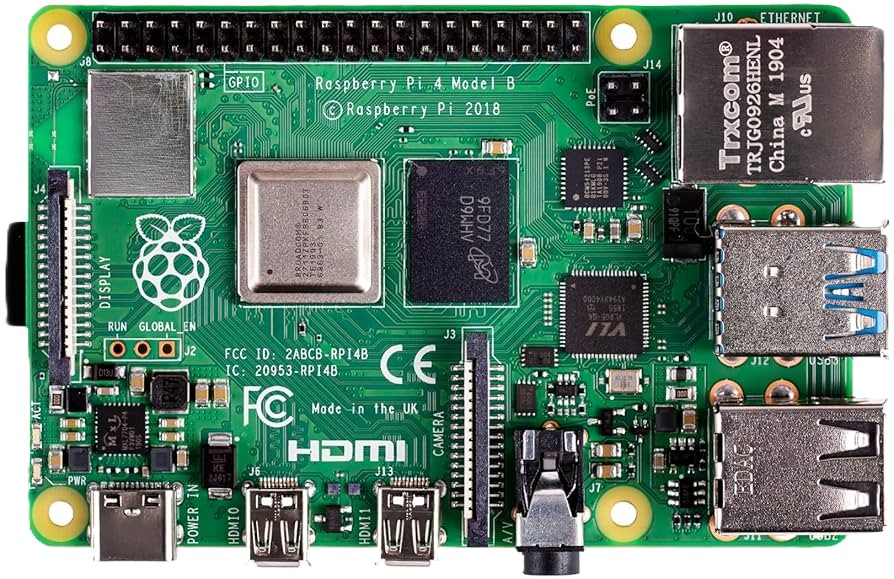

# 🖲️ Practicas Raspberry

---

---

## 1. [Led Intermitente](practica1.md)
## 2. [Led con Pulsador](practica2.md)
## 3. [Leds Semáforo](practica3.md)
## 4. [Detector Presencia con Salida Relé](practica4.md)
## 5. [Led Detector de Objetos con Fotointerruptor](practica5.md)
## 6. [Aviso Acústico de Inclinación](practica6.md)

---

## 👤 [AUTORES](autores.md)
