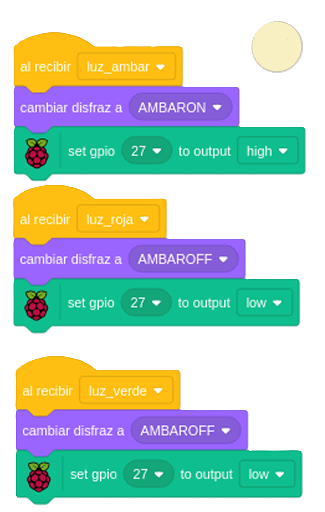

## 3. [Leds Semáforo](README.md)

### Led Rojo se enciende durante 10 segundos, pasa a Led Amarilla durante 1 segundo y termina Led Verde durante 10 segundos en bucle.

---

  
  
  
  

---

### 🎞️ [Descargar Video](https://raw.githubusercontent.com/Nando-Asir/practicasRaspberry/refs/heads/main/videos/semaforoLed.mov)
