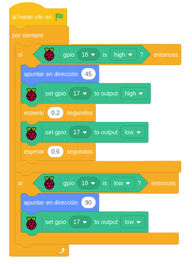

## 6. [Aviso Acústico de Inclinación](README.md)

### Al inclinarse el sensor, realiza un aviso acústico.

---

---

### 🎞️ [Descargar Video](https://raw.githubusercontent.com/Nando-Asir/practicasRaspberry/refs/heads/main/videos/avisoAcustico.mp4)
